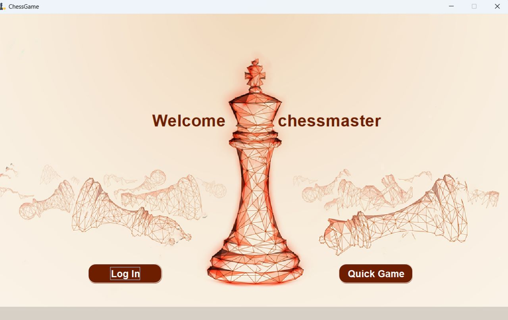
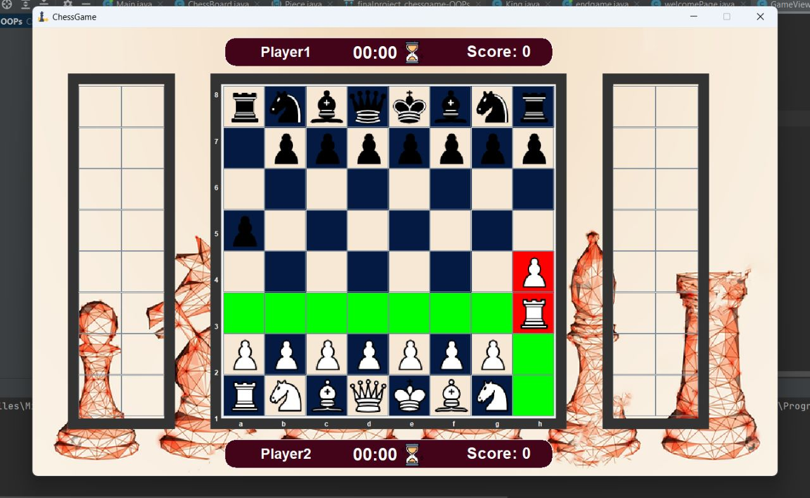

# Project discription:
The Chess Game is an object-oriented implementation of the classic game of chess. It utilizes the principles of OOP to create a modular and extensible design that represents the various elements of the game.

The game consists of different objects representing the chessboard, pieces, players, and game logic. Here's a breakdown of the key OOP concepts used in the implementation:

1- Encapsulation: The game components are encapsulated into classes, allowing data and behavior to be bundled together. For example, the ChessPiece class encapsulates information about a specific chess piece, such as its type, color, and position.

2- Inheritance: Inheritance is used to represent the hierarchy of different types of chess pieces. The ChessPiece class serves as a base class, and specific piece types like Pawn, Rook, Knight, etc., inherit from it, inheriting common attributes and behaviors while adding their own unique characteristics.

3- Polymorphism: Polymorphism is utilized to handle different types of chess pieces uniformly. By treating each chess piece as an instance of the ChessPiece class, the game can handle diverse pieces in a consistent manner, such as moving, capturing, and checking for valid moves.

4- Abstraction: Abstraction is employed to hide the complexity of the game's internal workings and expose only the necessary interfaces to interact with the game. Users can interact with the game through high-level methods like movePiece() or isCheckmate() without needing to understand the underlying implementation details.

Here is the GUI:

##Game features:
1- Classic Chess Gameplay: Experience the timeless game of chess with all the traditional rules and mechanics.

2- Piece Promotion: When a pawn reaches the opposite end of the board, players have the option to promote it to a more powerful piece, such as a queen, rook, bishop, or knight. Choose wisely to gain an advantage over your opponent.

3- Castling Move: Utilize the special castling move, which allows the king to move two spaces towards a rook and then move the rook to the other side of the king. This move provides opportunities for both king safety and developing the rook.

Highlight Legal Moves: Visualize the legal moves available for each piece on the chessboard, helping players plan their strategies and make informed decisions.

4- History: Keep track of the history, and the user records.

5- Intuitive User Interface: Provide a user-friendly interface with intuitive controls, clear instructions, and an appealing design that enhances the overall gaming experience.

6- Timer: Implement a timer feature that adds an element of urgency and strategic decision-making to the game. Each player has a limited amount of time to make their moves, adding excitement and challenging players to think quickly and efficiently. The timer feature can be customizable, allowing players to set their preferred time limits per move or overall game duration.

##Game Rules :
1- Pawn:
Moves forward one square, captures diagonally.
On the first move, can move one or two squares forward.
Can be promoted to any other piece (except the king) when it reaches the opposite end of the board.

2- Rook (Castle):
Moves vertically or horizontally to any unobstructed square.

3- King:
Moves one square in any direction.
Can perform a "castling" move with a rook under specific conditions: neither the king nor the rook have moved, no pieces are between them, and the king is not in check.

4- Bishop (Elephant):
Moves diagonally, bypassing any pieces.
Can also move one square horizontally to change the diagonal color.

5- Queen:
Combines the powers of the rook and bishop, making it the most mobile and powerful piece.

6- Knight:
Moves in an L-shape: two squares horizontally or vertically, and then three squares in the perpendicular direction.
